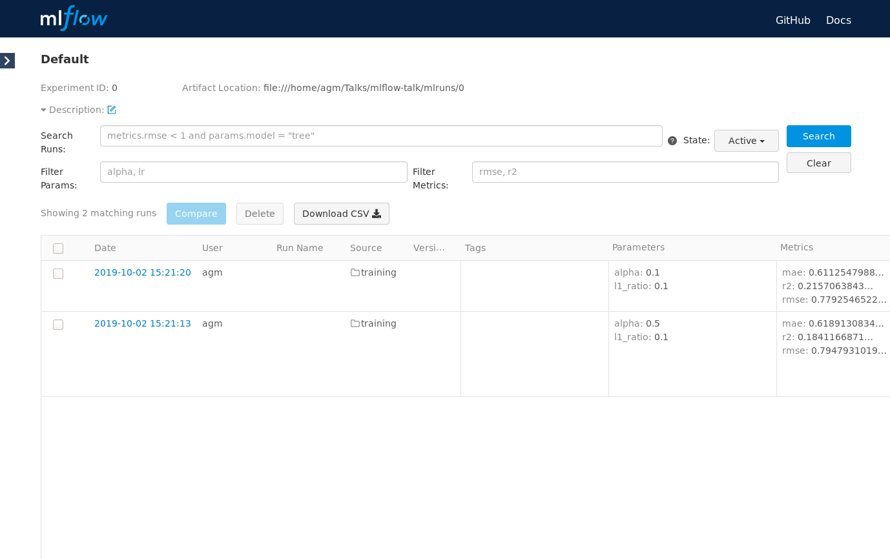
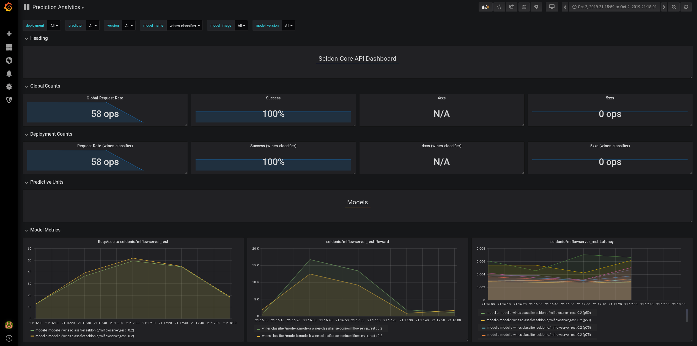

# MLFlow and Seldon

End to end example integrating MLFlow and Seldon, with A/B testing of the models.
The slides accompanying this demo can be [found here](https://docs.google.com/presentation/d/1QXiOZkd_XNw6PbUalhYDajljKYQjgKczzNncTyLk9uA/edit?usp=sharing).

## Pre-requisites

### Python

The training part of the example assumes that you are able to run `mlflow` on your local environment.
To set it up, you can run:


```python
!pip install -r requirements.txt
```

### Kubernetes

The serving side of the example assumes that you've got access to a Kubernetes cluster where Seldon Core is installed.
If you don't have access to a local cluster, feel free to use [`kind`](https://kind.sigs.k8s.io/).

For instructions on how to install Seldon Core, please check their [setup docs](https://docs.seldon.io/projects/seldon-core/en/latest/workflow/install.html).

### Analytics

Additionally, after we deploy the models, we will compare their performance using Seldon Core's integration with Prometheus and Grafana.
For that part to work, we will need to install Prometheus and Grafana.

To speed things up, we can do this through the [`seldon-core-analytics` chart](https://docs.seldon.io/projects/seldon-core/en/latest/charts/seldon-core-analytics.html).


```python
!helm install seldon-core-analytics \
    seldon-core-analytics \
    --namespace seldon-system \
    --repo https://storage.googleapis.com/seldon-charts \
    --set grafana.adminPassword=password \
    --set grafana.adminUser=admin
```

## Training

This first section will cover how to train models using MLFlow.

### MLflow Project

The MLproject file defines:
- The environment where the training runs.
- The hyperparameters that can be tweaked. In our case, these are $\{\alpha, l_{1}\}$.
- The interface to train the model.


```python
%%writefile ./training/MLproject
name: mlflow-talk

conda_env: conda.yaml

entry_points:
  main:
    parameters:
      alpha: float
      l1_ratio: {type: float, default: 0.1}
    command: "python train.py {alpha} {l1_ratio}"
```

This allows us to have a single command to train the model. 

``` bash
$ mlflow run ./training -P alpha=... -P l1_ratio=...
```

For our example, we will train two versions of the model, which we'll later compare using A/B testing.

- $M_{1}$ with $\alpha = 0.5$
- $M_{2}$ with $\alpha = 0.75$


```python
!mlflow run ./training -P alpha=0.1
```


```python
!mlflow run ./training -P alpha=1.0
```

### MLflow Tracking

The `train.py` script uses the `mlflow.log_param()` and `mlflow.log_metric()` commands to track each experiment. These are part of the `MLtrack` API, which tracks experiments parameters and results. These can be stored on a remote server, which can then be shared across the entire team. However, on our example we will store these locally on a `mlruns` folder.


```python
!ls mlruns/0
```

We can also run `mlflow ui` to show these visually. This will start the MLflow server in http://localhost:5000.

```bash
$ mlflow ui
```



### MLflow Model

The `MLmodel` file allows us to version and share models easily. Below we can see an example.


```python
!cat ./mlruns/0/5a6be5a1ef844783a50a6577745dbdc3/artifacts/model/MLmodel
```

As we can see above the `MLmodel` keeps track, between others, of

- The experiment id, `5a6be5a1ef844783a50a6577745dbdc3`
- Date 
- Version of `sklearn` 
- How the model was stored

As we shall see shortly, the pre-packaged Seldon's model server will use this file to serve this model.

#### Upload models (optional)

As a last step, we will persist the models we have just trained using `MLflow`. For that, we will upload them into Google Cloud Storage. Note that to run these commands you need write access into the `gs://seldon-models` bucket and you need to have `gsutil` set up.

Note that in a production setting, MLflow would be configured to log models against a persistent data store (e.g. GCS, Minio, etc.). In that case, this manual step wouldn't be needed.

We will upload both versions of the model to:

- `gs://seldon-models/mlflow/model-a`
- `gs://seldon-models/mlflow/model-b`


```python
!gsutil cp -r mlruns/0/c047eddcdc2d4a08963f08516fd18d74/artifacts/model/* gs://seldon-models/mlflow/model-a
!gsutil cp -r mlruns/0/1aab766b2d9246ed85f8dbfec4e8743d/artifacts/model/* gs://seldon-models/mlflow/model-b
```

## Serving

To serve this model we will use Seldon.

### Deploy models

Once the cluster is set up, the next step will to upload these models into a common repository and to deploy two `SeldonDeployment` specs to `k8s`. As we can see below, we will route 50% of the traffic to each of the models.


```python
%%writefile ./serving/model-a-b.yaml
---
apiVersion: machinelearning.seldon.io/v1alpha2
kind: SeldonDeployment
metadata:
  name: wines-classifier
spec:
  name: wines-classifier
  predictors:
  - graph:
      children: []
      implementation: MLFLOW_SERVER
      modelUri: gs://seldon-models/mlflow/model-a
      name: wines-classifier
    name: model-a
    replicas: 1
    traffic: 50
    componentSpecs:
    - spec:
        # We are setting high failureThreshold as installing conda dependencies
        # can take long time and we want to avoid k8s killing the container prematurely
        containers:
        - name: wines-classifier
          livenessProbe:
            initialDelaySeconds: 60
            failureThreshold: 100
            periodSeconds: 5
            successThreshold: 1
            httpGet:
              path: /health/ping
              port: http
              scheme: HTTP
          readinessProbe:
            initialDelaySeconds: 60
            failureThreshold: 100
            periodSeconds: 5
            successThreshold: 1
            httpGet:
              path: /health/ping
              port: http
              scheme: HTTP
  - graph:
      children: []
      implementation: MLFLOW_SERVER
      modelUri: gs://seldon-models/mlflow/model-b
      name: wines-classifier
    name: model-b
    replicas: 1
    traffic: 50
    componentSpecs:
    - spec:
        # We are setting high failureThreshold as installing conda dependencies
        # can take long time and we want to avoid k8s killing the container prematurely
        containers:
        - name: wines-classifier
          livenessProbe:
            initialDelaySeconds: 60
            failureThreshold: 100
            periodSeconds: 5
            successThreshold: 1
            httpGet:
              path: /health/ping
              port: http
              scheme: HTTP
          readinessProbe:
            initialDelaySeconds: 60
            failureThreshold: 100
            periodSeconds: 5
            successThreshold: 1
            httpGet:
              path: /health/ping
              port: http
              scheme: HTTP
```


```python
!kubectl apply -f ./serving/model-a-b.yaml
```

We can verify these have been deployed by checking the pods and `SeldonDeployment` resources in the cluster.


```python
!kubectl get pods
```


```python
!kubectl get sdep
```

### Test models

We will now run a sample query to test that the inference graph is working.


```python
!curl \
    -X POST \
    -H 'Content-Type: application/json' \
    -d '{\
        "data": { \
            "names": ["fixed acidity","volatile acidity","citric acid","residual sugar","chlorides","free sulfur dioxide","total sulfur dioxide","density","pH","sulphates","alcohol"], \
            "ndarray": [[7,0.27,0.36,20.7,0.045,45,170,1.001,3,0.45,8.8]] \
        } \
    }' \
    http://localhost:8083/seldon/default/wines-classifier/api/v1.0/predictions
```

## Analytics

To access Grafana, it will be necessary to forward the port to the respective pod as we did previously to access the Seldon Core deployment.
The credentials will be simply `admin` // `password`.

This command needs to run constantly on the background, so **please make sure you run it on a separate terminal**.

```bash
$ kubectl port-forward \
    $(kubectl get pods \
        -l app=grafana-prom-server -o jsonpath='{.items[0].metadata.name}') \
    3000:3000
```

Now that we have both models running in production, we can analyse their performance using Seldon Core's integration with Prometheus and Grafana.
To do so, we will iterate over the training set (which can be foud in `./training/wine-quality.csv`), making a request and sending the feedback of the prediction.

Since the `/feedback` endpoint requires a `reward` signal (i.e. higher better), we will simulate one as

$$
  R(x_{n})
    = \begin{cases}
        \frac{1}{(y_{n} - f(x_{n}))^{2}} &, y_{n} \neq f(x_{n}) \\
        500 &, y_{n} = f(x_{n})
      \end{cases}
$$

, where $R(x_{n})$ is the reward for input point $x_{n}$, $f(x_{n})$ is our trained model and $y_{n}$ is the actual value.


```python
### %%writefile feedback.py
import pandas as pd
import numpy as np
from seldon_core.seldon_client import SeldonClient

sc = SeldonClient(
    gateway="istio", 
    namespace="default",
    gateway_endpoint="localhost:8083",
    deployment_name='wines-classifier')

df = pd.read_csv("./training/wine-quality.csv")

def _get_reward(y, y_pred):
    if y == y_pred:
        return 500    
    
    return 1 / np.square(y - y_pred)

def _test_row(row):
    input_features = row[:-1]
    feature_names = input_features.index.to_list()
    X = input_features.values.reshape(1, -1)
    y = row[-1].reshape(1, -1)
    
    r = sc.predict(
        data=X,
        names=feature_names)
    
    y_pred = r.response['data']['tensor']['values']
    reward = _get_reward(y, y_pred)
    sc.feedback(
        prediction_request=r.request,
        prediction_response=r.response,
        reward=reward)
    
    return reward[0]

df.apply(_test_row, axis=1)
```


```python
!python feedback.py
```

 We can now access the Grafana dashboard in http://localhost:3000 (credentials are `admin` // `password`). Inside the portal, we will go to the Prediction Analytics dashboard.
 
 
We can see a snapshot below.




```python

```
